# Estratégia de Autenticação Admin

## Provider

- **Auth.js v5 (NextAuth v5)** com provider **GitHub OAuth** (preferencial — sem gestão de senhas, alinhado ao fato de o projeto já viver no GitHub).
- Sessão em **JWT** (sem tabela `session` no DB — reduz uma dependência de escrita no Neon a cada login, mais simples operacionalmente).

## Allowlist

- Variável de ambiente `ADMIN_EMAILS` (CSV, ex.: `rodrigo.jeronimo@msn.com,outro@exemplo.com`), validada via `@t3-oss/env-nextjs`.
- Callback `signIn` do Auth.js verifica se `profile.email` está na allowlist; caso contrário, rejeita o login (retorna `false`), sem criar sessão.
- Allowlist é a única fonte de autorização — não há tabela de usuários/roles no DB (simplicidade operacional; o site tem um único operador).

## Proteção de rotas

- `middleware.ts` intercepta `/admin/*`, verifica sessão JWT válida via `auth()` do Auth.js.
- Sem sessão válida → redirect para `/admin/login`.
- Rotas públicas (`app/(public)/**`) nunca passam pelo middleware de auth.

## Fluxo

```mermaid
sequenceDiagram
    actor Admin
    participant MW as middleware.ts
    participant Login as /admin/login
    participant GH as GitHub OAuth
    participant CB as signIn callback
    participant Admin_UI as /admin/**

    Admin->>MW: acessa /admin/*
    MW-->>Admin: sem sessão -> redirect /admin/login
    Admin->>Login: clica "Entrar com GitHub"
    Login->>GH: OAuth authorize
    GH-->>CB: retorna profile (email)
    CB->>CB: email in ADMIN_EMAILS?
    alt autorizado
        CB-->>Admin_UI: sessão JWT criada, redirect /admin
    else não autorizado
        CB-->>Login: signIn retorna false, erro exibido
    end
```

## Variáveis de ambiente relacionadas

`AUTH_SECRET`, `AUTH_GITHUB_ID`, `AUTH_GITHUB_SECRET`, `ADMIN_EMAILS` — documentadas em `.env.example` (Fase 2/3).
