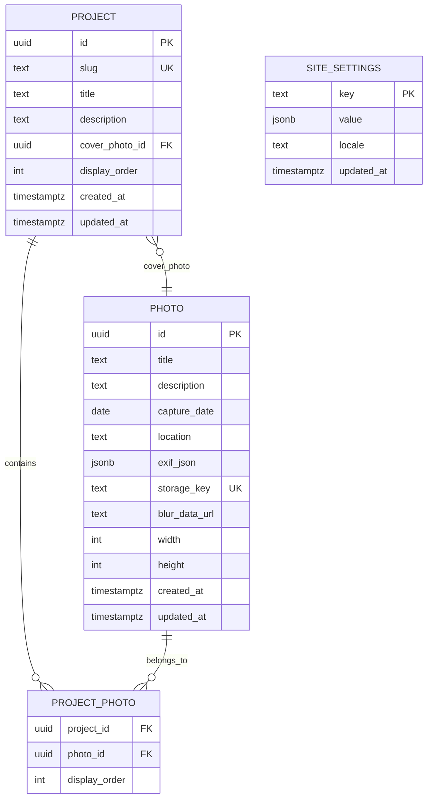

# Modelo de Dados

## Tabelas

### `project`
Categoria/projeto (ex.: Paisagens, Macro, Vida Selvagem, Long Exposure).
- `id` uuid PK
- `slug` text, **unique** (rota pública `/[locale]/projetos/[slug]`)
- `title`, `description` text
- `cover_photo_id` uuid FK → `photo.id`, nullable
- `display_order` int (ordem de exibição na home)
- `created_at`, `updated_at` timestamptz

### `photo`
Foto individual com metadados e referência ao objeto no R2.
- `id` uuid PK
- `title`, `description` text
- `capture_date` date, nullable
- `location` text, nullable (opcional, ver `security.md` sobre GPS/EXIF)
- `exif_json` jsonb, nullable (subconjunto sanitizado de EXIF)
- `storage_key` text, **unique** (chave do objeto original no R2; variantes derivadas por convenção de path, ex. `{storage_key}/thumb.avif`, `{storage_key}/medium.webp`)
- `blur_data_url` text (LQIP base64 para `next/image` `placeholder="blur"`)
- `width`, `height` int (dimensões originais, para `next/image` sem CLS)
- `created_at`, `updated_at` timestamptz

### `project_photo` (N:N)
- PK composta (`project_id`, `photo_id`)
- `project_id` uuid FK → `project.id` **ON DELETE CASCADE**
- `photo_id` uuid FK → `photo.id` **ON DELETE CASCADE**
- `display_order` int
- Índice: `(project_id, display_order)` para ordenação eficiente na galeria

### `site_settings`
Conteúdo editável via admin (Sobre Mim, Contato, textos institucionais), chave-valor por locale.
- `key` text PK (ex.: `about.bio`, `contact.email`)
- `value` jsonb
- `locale` text (`pt-BR` | `en`)
- `updated_at` timestamptz

## Índices

- `project.slug` — unique
- `photo.storage_key` — unique
- `project_photo (project_id, display_order)` — composto, para listagem ordenada
- `site_settings (key, locale)` — composto unique

## Drizzle schema draft

Ver `drizzle/schema.ts` (draft de referência — instalado formalmente na Fase 2 quando o projeto Next.js for inicializado).

