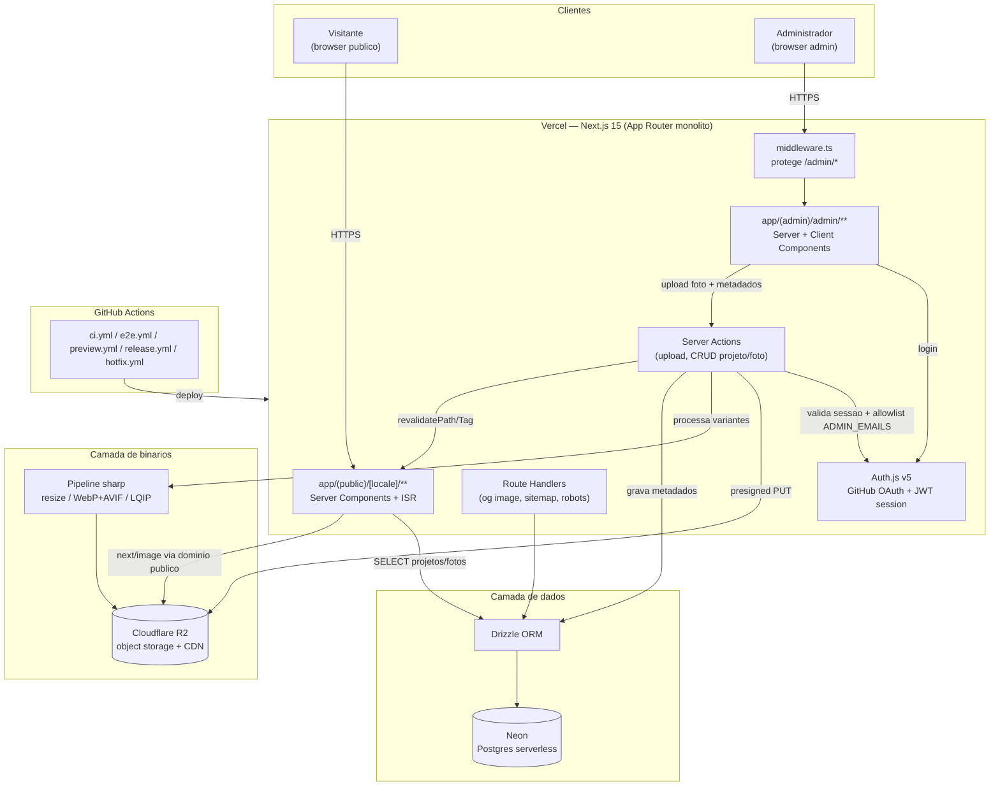

# Arquitetura — Visão Geral

Stack monolítica Next.js 15 (App Router) hospedada na Vercel, sem microsserviços, sem Kubernetes. Um único deploy serve tanto o site público quanto o painel administrativo, diferenciados por route groups e middleware de autenticação.

## Componentes

- **Público (`app/(public)`)**: Home/Galeria, Sobre, Contato, páginas de Projeto/Categoria (`[slug]`). Renderizado via Server Components com ISR (`revalidate` + `revalidatePath` sob demanda).
- **Admin (`app/(admin)/admin`)**: protegido por `middleware.ts`, que verifica sessão JWT do Auth.js e allowlist de e-mail. CRUD de projetos/fotos via Server Actions, sem necessidade de API REST separada.
- **Auth.js v5**: provider GitHub OAuth, sessão JWT (sem tabela de sessão no DB), callback `signIn` valida contra `ADMIN_EMAILS`.
- **Drizzle + Neon**: metadados relacionais (Project, Photo, ProjectPhoto, SiteSettings).
- **Pipeline `sharp` + R2**: no momento do upload, gera variantes (thumbnail, medium, original) em WebP/AVIF + LQIP blur placeholder; grava no R2; URL pública servida via `next/image` com loader customizado apontando para o domínio público do bucket.
- **GitHub Actions**: CI (lint/type-check/test/build), e2e (Playwright contra preview), preview deploy por PR, release para produção, hotfix.

Ver detalhamento em `upload-flow.md` (sequência), `data-model.md` (schema), `caching-strategy.md`, `seo-strategy.md`, `auth-strategy.md`, `security.md`, `folder-structure.md`.
