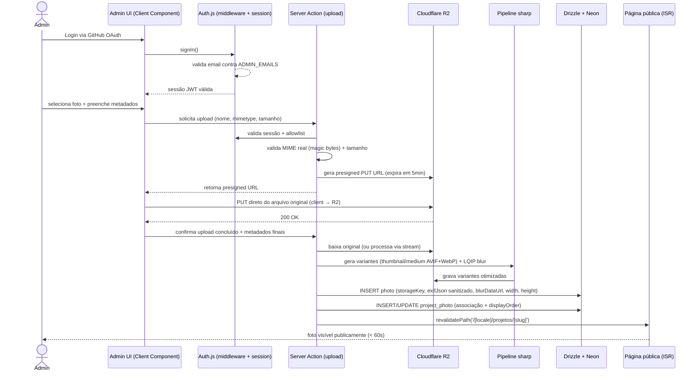

# Fluxo de Upload de Foto

## Notas

- Upload do arquivo original vai **direto do client para o R2** via presigned URL — o Server Action não faz proxy do binário, evitando limites de payload de Server Actions/Route Handlers na Vercel.
- O processamento (`sharp`) roda no Server Action após confirmação de upload, lendo o objeto original do R2 e escrevendo as variantes de volta.
- EXIF é extraído e sanitizado antes de gravar em `photo.exif_json` (ver `security.md`).
- `revalidatePath` (ou `revalidateTag` se usarmos tags por projeto) garante que a página pública do projeto reflita a nova foto em até 60s, sem novo deploy.
